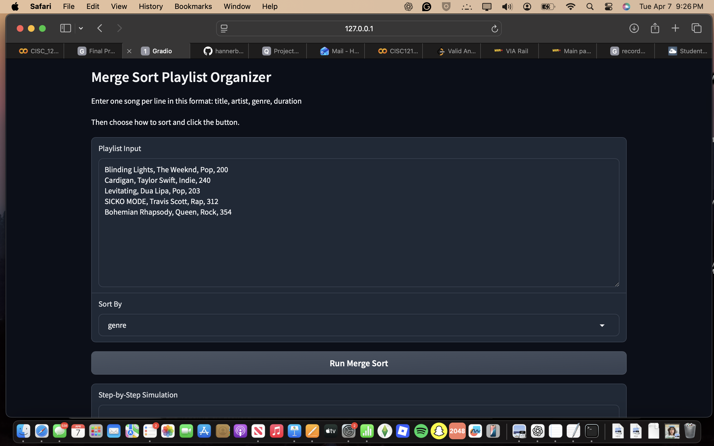
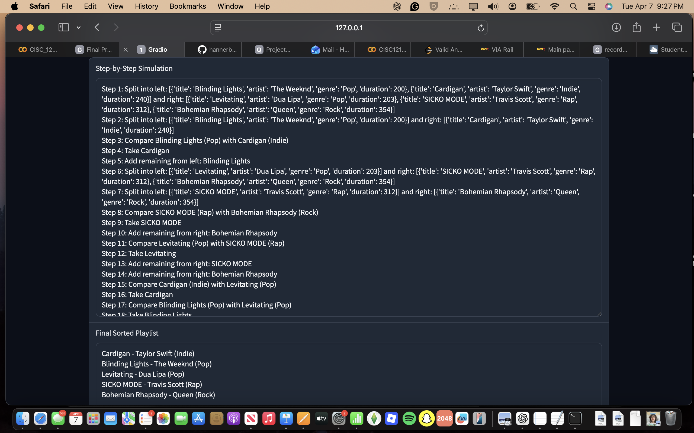
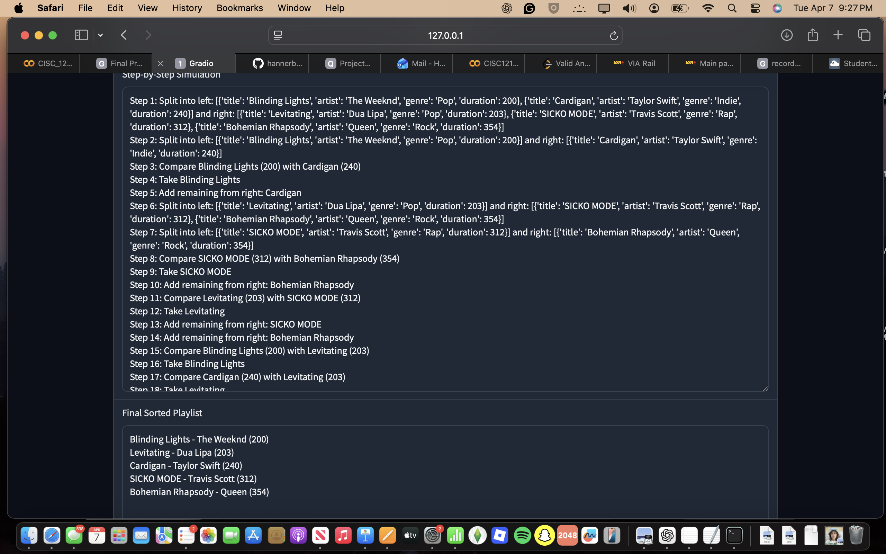
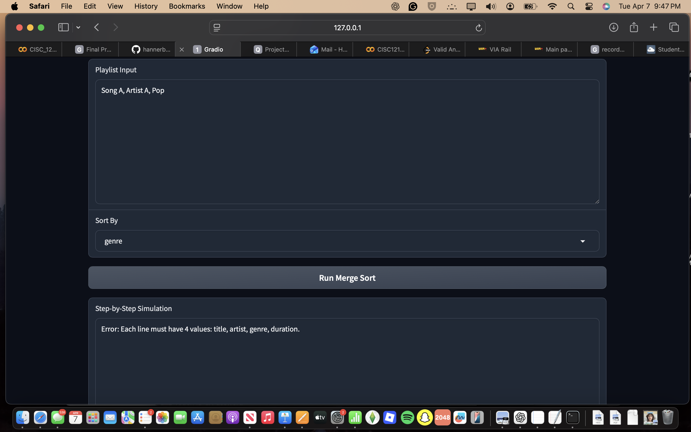
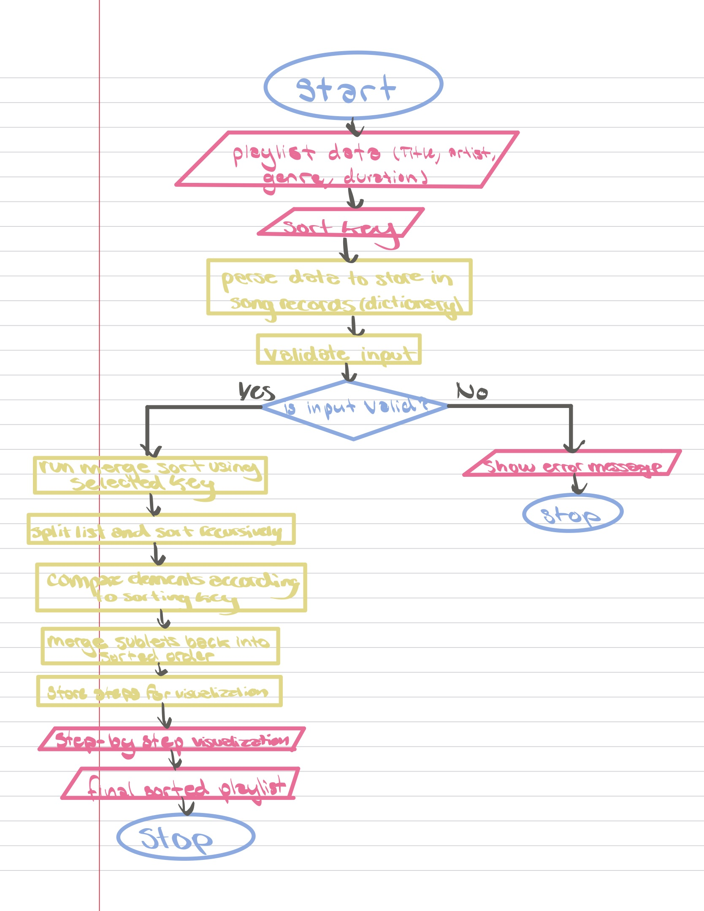

# Merge Sort Playlist Organizer

## Demo video/gif/screenshot of test

---

## Problem Breakdown & Computational Thinking

### Problem Breakdown (Decomposition)
- Take playlist input from the user in text form
- Split the input into individual songs
- Convert each song into a structured dictionary (title, artist, genre, duration)
- Validate input (check for missing or incorrect values)
- Apply Merge Sort to organize songs
- Display step-by-step sorting process
- Display final sorted playlist

---

### Pattern Recognition
- The sorting process repeatedly divides the list into smaller parts
- Each part is sorted individually
- Sorted parts are merged together in order
- The same comparison pattern is used for both strings (genre) and numbers (duration)

---

### Abstraction
- The user only sees key steps like splits, comparisons, and merges
- Internal details like recursion and index tracking are hidden
- The same algorithm works for different sorting keys (genre or duration)

---

### Algorithm Design
- Input: playlist text and selected sorting key
- Process:
  - Parse input into structured data
  - Validate data
  - Recursively split list (Merge Sort)
  - Compare and merge sorted lists
  - Record steps during sorting
- Output:
  - Step-by-step simulation
  - Final sorted playlist

---

### Flowchart

---

## Why Merge Sort Fits

Merge Sort is well suited for this problem because it efficiently handles lists and consistently performs at O(n log n) time. It also clearly demonstrates the divide-and-conquer approach, making it ideal for visualizing the step-by-step sorting process in this application.
---

## Steps to Run

1. Install required packages:
   pip install -r requirements.txt

2. Run the application:
   python3 app.py

3. Open the link shown in the terminal (usually http://127.0.0.1:7860)

4. Enter playlist data in the format: title, artist, genre, duration

5. Select a sorting option (genre or duration) and click "Run Merge Sort" to view the step-by-step process and final sorted playlist
---

## Hugging Face Link

(Add your Hugging Face Space link here after deployment)

---

## Author & AI Acknowledgment

Author: Hannah

AI Acknowledgment:
AI was used to assist with understanding concepts such as Merge Sort, debugging code errors, and improving code structure. All final implementation decisions, testing, and modifications were completed by the author.